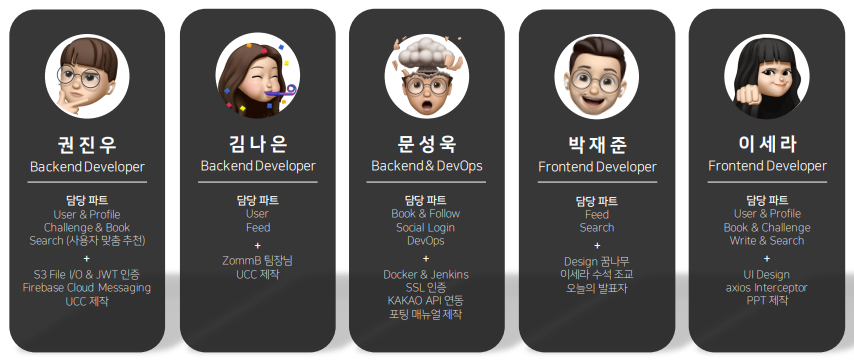
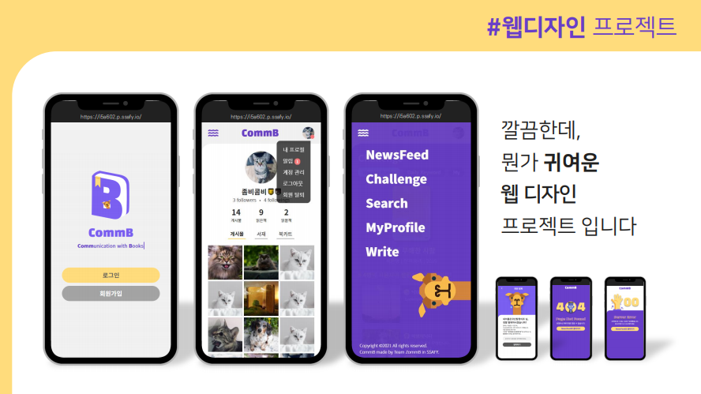
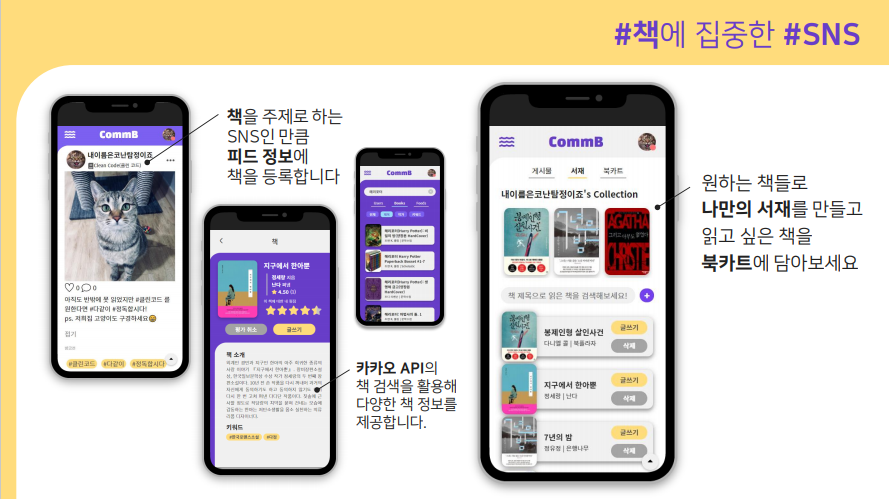
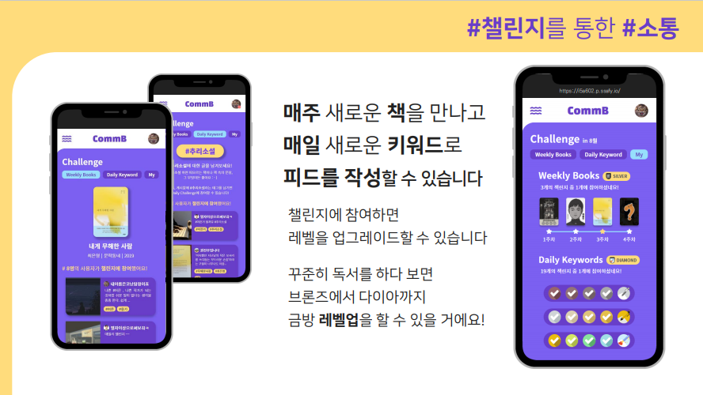

# CommB 📚

> Vue와 SpringBoot를 활용한 독서 관련 웹 SNS 개발 공간입니다.

## 🌈 About

- 개발 언어

  - Vue.js 2.6.11 | vue/cli 4.5.0
  - Springboot 2.5.2 | Gradle 6.8.3

  

- 팀원 정보 및 업무 분담

  

## 🌟 Overview

- **Comm**unication with **B**ooks

  - '책'을 중심으로 소통하는 웹 SNS 프로젝트

  

## 🚀 Service

#### 1. 모바일 사이즈에 집중한 웹 디자인

- CommB는 모바일 사이즈를 기반으로 개발된 웹 SNS입니다.

  - 기존 SNS 플랫폼의 깔끔한 UI에 CommB만의 귀여운 포인트를 더해 UI 디자인을 진행했습니다.

  

  

#### 2. 다양한 책 정보와 관련 기능

- 카카오 책 검색 API와의 연동을 통해 다양한 책 정보를 제공하며, 책과 관련한 여러 기능을 이용할 수 있습니다.

  1. 피드 작성 시, 게시물과 연관된 책을 등록할 수 있습니다.
  2. 카카오 책 검색 API를 사용하여 다양한 책 정보를 열람할 수 있습니다.
     - CommB에서 책을 검색할 경우, 카카오 API와의 통신을 통해 책 정보를 제공합니다. 이때, CommB DB에 없는 책일 경우 자동으로 DB에 추가하도록 로직을 구현했습니다.
  3. 프로필 페이지에서 서재와 북카트 탭을 활용할 수 있습니다.
     - 본인이 읽은 책을 서재에 추가할 수 있으며, 그 중 마음에 드는 책을 상단 컬렉션 바에 추가할 수 있습니다. 
     - 읽고 싶은 책이 생기며 북카트에 추가해 목록을 볼 수 있습니다.

  

#### 3. 꾸준한 독서 권장을 위한 챌린지

- 사용자들의 꾸준한 독서를 권장하기 위해 위클리/데일리 챌린지를 운영합니다.

  - 위클리 챌린지에서는 매주 새로운 책을 추천합니다. 해당 책을 주제로 작성한 피드는 하단에 표시되어 피드 내용을 볼 수 있습니다.
  - 데일리 챌린지에서는 매일 새로운 키워드를 추천합니다. 해당 키워드를 태그로 등록한 피드는 하단에 표시되어 피드 내용을 볼 수 있습니다.
  - 내 챌린지 페이지를 통해 챌린지 수행 여부를 확인할 수 있으며, 그에 따라 챌린지 뱃지가 조정됩니다. 뱃지는 프로필에 표시할 수 있도록 디자인했습니다.

  

## 👀 Project Review in FE

#### GOOD 👍

- JWT 토큰 인증과 서버 에러를 관리하는 과정에서  `axios interceptor`를 활용했습니다.  [참고문서](https://github.com/axios/axios#interceptors)
  - 인터셉터의 주요 기능은 500 Server Error 핸들링, access token·refresh token 저장 및 header에 추가, 토큰 만료 여부에 따른 추후 작업이었습니다.
  - 토큰 만료 시 추후 작업은 두 단계로 나눠,
    - access token만 만료되었을 경우, refresh token을 header에 추가해 기존 요청을 다시 보내고 새롭게 발급받은 token을 저장하는 방식이며
    - refresh token까지 모두 만료되었을 경우, 로그아웃을 하도록 조정했습니다.
- 로그인 사용자만 이용할 수 있는 페이지의 경우, `vue-router 내비게이션 가드`를 활용해 접근 권한을 분리했습니다. [참고문서](https://router.vuejs.org/kr/guide/advanced/navigation-guards.html)
- 피드와 프로필 이미지를 정방형 사이즈로 crop할 수 있는 라이브러리를 추가했고, 모바일에서 활용이 가장 쉽다고 판단한 `vue croppa`를 사용했습니다. [참고문서](https://zhanziyang.github.io/vue-croppa/#/)

- 게시물이나 검색 결과는 인피니트 스크롤을 적용했으며, 그 과정에서 Lazy load 효과를  JS로 구현했습니다.
  - 인피니트 스크롤의 경우, 마지막 게시물이 화면 하단과 가까워졌을 때 다음 페이지 요청을 보내도록 구성했고 해당 페이지에 콘텐츠가 없을 경우 요청을 멈추는 로직으로 구성했습니다.
  - scroll 이벤트를 기반으로 화면 사이즈와 게시물의 위치를 계산하여 opacity와 translateY를 조정해 lazy load 효과를 구현했습니다. 

- 카카오 API를 이용한 책 검색의 경우, space가 포함되었을 때 에러가 나는 상황을 인지하고 해결 방법을 찾았습니다.

  - input 단어에서 space가 포함될 경우 `+`로 변환하는 방식을 도입해 띄어쓰기가 있는 경우에도 정상적으로 작동하도록 fix했습니다.

  

#### Need to Improve 🚧

- 여러 명이 함께하는 첫 프로젝트인 만큼 결과물에 대한 아쉬움과 함께 협업 방식에 대한 고민도 많이 하게 되는 것 같습니다. 

  - 초반에 프론트엔드 파트에서 대분류를 기준으로 3개씩 업무 분배를 하게 되었는데, 작성해야 하는 코드와 컴포넌트 작업량의 차이가 생각보다 많았습니다. 지금 생각해보면, 처음부터 모든 업무를 나누기보다는 각자의 작업 속도에 따라 유기적으로 작업 분배를 할 수 있었다면 조금 더 안정적으로 작업을 할 수 있지 않았을까 하는 아쉬움이 남습니다.
  - 같은 맥락에서 프로젝트 마무리 단계에 완성되지 못한 부분이 많아 급하게 작업을 하게 되었습니다. 이 때문에 컴포넌트 구조화도 예상대로 되지 않았고, 중복된 코드가 사용된 경우가 꽤 많았습니다.
    -  이 부분에 대해서는 여러 아쉬움이 남아 이후 프로젝트 진행에 도움이 될 수 있도록 개선점을 정리해보자면,
      1. UI 설계 단계에서 디자인뿐 아니라 컴포넌트 구조를 상세하게 구분하여 팀 내 합의도를 높여야 상호 간의 작업에 도움이 될 수 있다.
      2. 공통적으로 사용하는 CSS 코드는 초반부 작업과 같이 스타일시트로 정리해서 사용한다.
      3. 동일하거나 유사한 로직의 method, computed가 보이는데 이 역시 vuex를 좀 더 적극적으로 사용할 필요가 있다.
      4. 서로의 코드를 공유하면서 피드백할 수 있는 시간을 조금 더 둘 수 있었다면 혼선이 적었을 것 같다.

  - API 통신을 하며, 응답 데이터에 필요하지 않은 네스팅이 되어 있는 경우가 존재했습니다.  예를 들면, `response.data.data`의 방식으로 접근해야 하거나 Object에 아이템이 하나뿐인데 `response.data.<Object>.<key>`로 한 번 더 깊이 접근해야 하는 부분이 있었는데 기획 단계에서 api 설계를 조금 더 꼼꼼하게 해야겠다는 생각이 들었습니다.

